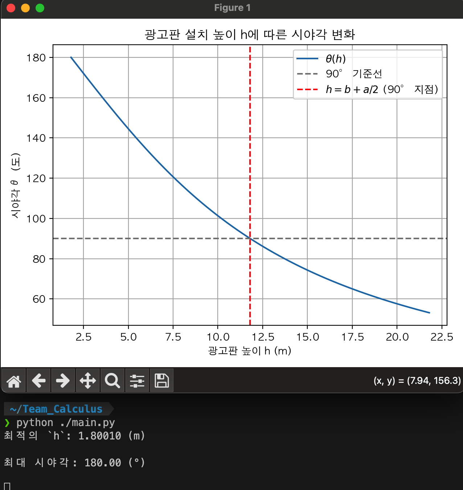

# 광고판 최적 시야각 실험 (with Python)
이 실험은 미적분학과벡터해석(1) 과목의 최적화 문제인
**광고판의 설치 높이(`h`)를 조절하여 시야각(`θ`)을 최대화하는 수치적 해석**을 목적으로 합니다.
___
## 문제
> 광고판 설치 위치 최적화:
> 
> 어느 도로변에 광고판을 설치하려고 한다. 광고판은 고정된 가로길이 `a`를 가지고 있으며,
> 지면에서 `h`미터 위에 설치된다. 광고판을 보는 사람의 눈높이는 지면에서 `b`미터이다.
> 사람이 광고판을 가장 넓은 시야각으로 보기 위해 광고판의 설치 높이 `h`를 최적화하라.

> `a`: 20.0, `b`: 1.8 (단위: m)
___
## 목적
- 수학적으로 `θ(h)`를 유도한 뒤,  
- 수치적으로 최댓값을 갖는 `h`를 탐색하고,  
- 그 결과를 시각화하여 직관적 이해를 돕는다.
___
## 구성 파일
```shell
.
├── config.py
├── graph.py
├── main.py
├── optimizer.py
├── README.md
└── result.png
```
### 코드 설명:
- `config.py`: 문제의 상수(`a`, `b`, `h`의 진행 값) 설정.
- `graph.py`: `θ(h)`의 그래프를 시각화하여 보여주는 모듈.
- `main.py`: 모든 모듈을 실행하는 엔트리 포인트.
- `optimizer.py`: `θ(h)`의 극댓값을 찾는 모듈.
##### REQUIREMENTS:
- `matplotlib`: 결과 시각화.
- `numpy`: 연산.
```shell
pip install numpy; pip install matplotlib
```
또는:
```shell
pip3 install numpy; pip3 install matplotlib
```
#### 아이디어:
1. 초기 값을 함수 `theta()`에 넣어 시야각을 구함.
2. 현재 도출된 시야각과 이전 시야각을 비교해 현재 시야각이 이전 시야각보다 더 작으면 루프를 종료.
    2-1. 그렇지 않으면, 값을 업데이트하여 시야각을 구함.
3. `2.`조건을 만족할 때 까지 무한 반복.
### 주요 함수 & 코드:
- `optimizer.py`에서:
```python
# 시야각 구하는 함수
def theta(h, a=A, b=B):
    """
    `h`: 광고판과 지면 사이의 높이,
    `horizontal_lenth`: 광고판의 가로 길이,
    `height`: 관찰자의 키
    """
    return 2 * np.arctan((a / 2) / (h - b))

def optimize_theta(b=B, step=STEP):
    h_value: float = b + step # 미지수 `h`

    prev_theta = theta(h_value)

    # 극한 구해보기 (컴퓨터 가혹행위)
    while(True):
        cur_theta: float = theta(h_value)

        if cur_theta < prev_theta:
            """
            업데이트된 시야각은 이전 것보다 낮으므로,
            이전 최대 시야각으로 되돌려 놓기
            """
            h_value -= step
            cur_theta = theta(h_value)

            break # 루프 종료
        h_value += step

    print(f"최적의 `h`: {(h_value):.5f} (m)\n")
    print(f"최대 시야각: {np.degrees(cur_theta):.2f} (°)\n")
```
___
## 실행 및 결과
```shell
python ./main.py
```
또는:
```shell
python3 ./main.py
```
- 결과:

`θ`는 `h`가 관찰자 눈높이(`b`)에 가까워질수록 180°에 가까워짐.
___
## 실험 기여자
- Python 실험 기획, 구현: 소프트웨어학부 2025245045 명윤재
`미적분학과벡터해석(1)` 과제 실험 및 발표 자료용 입니다.